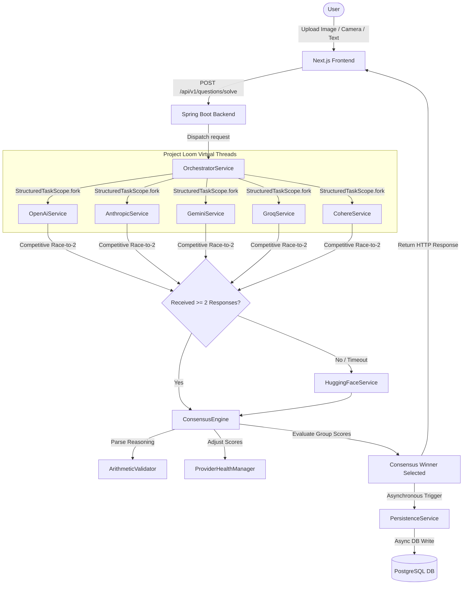
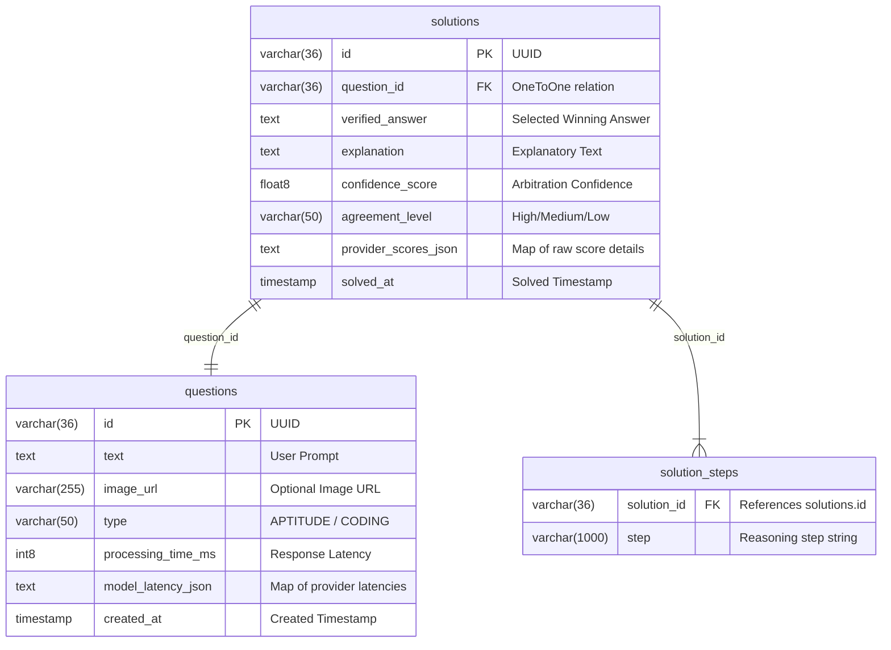

# VeriSolve 

[](https://spring.io/projects/spring-boot)
[](https://nextjs.org/)
[](https://www.oracle.com/java/)
[](https://www.postgresql.org/)

A self-calibrating multimodal AI arbitration platform that validates, scores, and synthesizes solutions across multiple LLM providers using concurrent virtual threads, weighted consensus engines, and real-time arithmetic reasoning validation.

---

## Project Overview

### The Problem
Single-model LLM inference is highly prone to **hallucinations**, **logical slips**, and **transient provider failures** (timeouts, rate limits, API outages). For complex analytical tasks—such as technical aptitude solving, competitive programming, and algorithm optimization—relying on a single model introduces a single point of failure in accuracy and uptime.

### The Solution
**VeriSolve** solves this by establishing a decentralized, multi-model consensus network. When a user submits an analytical or coding query (either via text or visual screenshot), VeriSolve acts as an **intelligent inference arbitrator**. It concurrently queries multiple top-tier AI providers (OpenAI, Anthropic, Gemini, Groq, Cohere), validates their reasoning steps programmatically, calculates a weighted consensus, and returns a verified, mathematically sound solution.

### Target Use Cases
*   **Aptitude Questions:** High-accuracy logical and math problem-solving.
*   **DSA & Coding Problems:** Structured, step-by-step algorithmic solutions adhering to rigorous complexity bounds.
*   **Engineering Architecture & Study Assistance:** Multimodal ingestion of diagrams, equations, or screenshots for precise conceptual explanations.

---

## Key Features

*   **Multi-Provider Concurrent AI Arbitration:** Queries OpenAI, Anthropic, Google Gemini, Groq, and Cohere concurrently using high-performance concurrent processing.
*   **Competitive "Race-to-2" Strategy:** Latency optimizer that waits for the fastest two Tier 1 responses within an 8-second window, dropping late-responding models to prevent slower providers from dragging down overall API response times.
*   **Tiered Fallback Execution:** Falls back automatically to local/fallback endpoints (Hugging Face / Qwen) in the event of major Tier 1 provider failures.
*   **Self-Calibrating Sensor Network (`ProviderHealthManager`):** Real-time tracking of provider health (Quota Exceeded, Authentication, Timeout, Logical Inconsistency), suppressing failing nodes and adjusting inference weights dynamically.
*   **Arithmetic Validation Layer:** Validates mathematical steps within each model's reasoning markdown using programmatic equation parsing. Deducts $20\%$ off a provider's confidence if it makes arithmetic slips (e.g. `12 + 3 = 14`).
*   **Strict DSA & Aptitude Prompt Engineering:** Context-aware prompts forcing models to output detailed classification, input/output constraints, strategy, and time/space complexity analysis when tackling coding problems.
*   **Multimodal Live Ingestion:** Supports drag-and-drop screenshots and direct access to device cameras via the HTML5 `MediaDevices` API.
*   **Multimodal Entropy Penalty:** Deducts $15\%$ off multimodal models if an image is provided but only one vision-capable model successfully returns a response (penalizing uncorroborated single-sensor visual interpretations).
*   **Neural Arbitration Matrix Dashboard:** High-fidelity user interface detailing individual node confidence, latency, statistical bias weights, and final consensus arbitration outputs.
*   **Asynchronous JPA Persistence:** Non-blocking persistence writes database logs of user queries, selected consensus answers, latencies, and provider scores asynchronously via Project Loom Virtual Threads.

---

## Architecture Overview

VeriSolve is engineered as an event-driven, microservices-inspired full-stack application composed of:
1.  **Next.js Frontend:** Single-page application using React 19, Framer Motion, and Tailwind CSS.
2.  **Spring Boot Backend:** Java 21 web application utilizing Project Loom Virtual Threads and JDBC PostgreSQL database.
3.  **Third-Party AI Sensor Network:** Multi-model integrations with OpenAI, Anthropic, Gemini, Groq, Cohere, and Hugging Face.

### System Topology Diagram


---

## System Design & Lifecycle

The lifecycle of an inference arbitration query travels through five distinct phases:

```
[Client Submit] ──> [Orchestration & Concurrency] ──> [Validation & Penalty] ──> [Consensus Arbitration] ──> [Async Persistence]
```

1.  **Request Ingestion:** The client sends a `multipart/form-data` payload containing an optional image, a text query, and a subject context (`CODING` or `APTITUDE`).
2.  **Concurrent Forking:** The `OrchestratorService` filters available providers using the `ProviderHealthManager`. Valid providers are forked using Java 21's `StructuredTaskScope<StructuredAIResponse>`.
3.  **The Race-to-2 Gate:** The orchestrator blocks until **at least two** Tier 1 providers succeed or the total timeout (8 seconds) is reached. Abandoned tasks are shutdown gracefully via `scope.shutdown()`. If less than 2 succeeded, the system invokes the fallback Tier 2 Hugging Face node.
4.  **Arithmetic Logic Validation:** The outputs are passed to the `ArithmeticValidator`. Programmatic logic filters extract equations and apply penalties.
5.  **Weighted Voting:** The `ConsensusEngine` normalizes the outputs, groups identical final answers, calculates final weighted consensus scores, and designates the winner.
6.  **Async Logging:** The HTTP response is returned to the user immediately. Asynchronously, `@Async` and `@Transactional` services map the entities and commit records to PostgreSQL.

---

## Tech Stack

### Frontend
*   **Framework:** Next.js 16.1.6 (React 19.2.3, TypeScript 5)
*   **Styling:** Tailwind CSS 4, Radix UI Primitives, Lucide Icons
*   **Animations:** Framer Motion 12.34.0 (for smooth micro-interactions)
*   **Code Sandbox:** `@monaco-editor/react` (for syntax-highlighted code output)
*   **Network:** Axios (Handling FormData and API boundaries)

### Backend
*   **Core:** Spring Boot 3.2.3, Java 21 (Preview features enabled for Structured Concurrency)
*   **Frameworks:** Spring Web, Spring Data JPA, Spring AI (OpenAI & Anthropic Boot Starters)
*   **Concurreny Engine:** Project Loom Virtual Threads (`spring.threads.virtual.enabled: true`), `StructuredTaskScope`
*   **Documentation:** Springdoc OpenAPI (Swagger UI)
*   **Tooling:** Lombok, Maven

### Database
*   **RDBMS:** PostgreSQL 16
*   **ORM:** Hibernate 6.x (leveraging JSON text serialization)

### AI Infrastructure
*   **OpenAI:** `gpt-3.5-turbo` / `gpt-4o` (custom model configurations)
*   **Anthropic:** `claude-3-haiku-20240307`
*   **Google Gemini:** `gemini-2.0-flash-001` (Gemini API Studio integration)
*   **Groq:** `llama-3.3-70b-versatile` (using OpenAI-compatible endpoints)
*   **Cohere:** `command-r-08-2024`
*   **Hugging Face (Fallback):** `Qwen/Qwen2.5-72B-Instruct`

---

## Consensus Engine & Mathematics

The `ConsensusEngine` executes a deterministic arbitration algorithm to elect the most reliable answer.

### 1. Individual Model Scoring
For each valid model response $i$:
$$\text{ModelScore}_i = \text{BiasWeight}(\text{provider}_i) \times \text{ConfidenceScore}_i$$

*   **Bias Weight ($\text{BiasWeight}$):** Retrieved dynamically from the `ProviderHealthManager`. Falls back to static weight defaults defined in the `ModelMetadataRegistry` (e.g. Claude: `0.9`, Gemini: `0.85`, OpenAI: `0.8`).
*   **Confidence Score ($\text{ConfidenceScore}$):** Self-reported confidence by the model ($[0.0, 1.0]$).

### 2. Math Logic Penalty
If the programmatic `ArithmeticValidator` detects an equation mismatch in the model's `reasoning_steps`:
$$\text{ConfidenceScore}_i = \text{ConfidenceScore}_i \times 0.80$$

### 3. Multimodal Entropy Penalty
If an image is present but only one vision-capable model ($M_{\text{vision}}$) succeeds:
$$\text{ModelScore}_i = \text{ModelScore}_i \times 0.85$$

### 4. Group Aggregation & Agreement Factor
Valid answers are normalized (trimmed, lowercased). Identical answers are grouped into set $G$. For each group $g \in G$:
$$\text{GroupScore}_g = \left( \sum_{i \in g} \text{ModelScore}_i \right) \times \text{AgreementFactor}_g$$
$$\text{AgreementFactor}_g = \frac{|g|}{N_{\text{valid}}}$$

Where $|g|$ is the number of models that agreed on answer $g$, and $N_{\text{valid}}$ is the total number of valid responses received in the current run.

### 5. Winning Criteria
The winning answer is:
$$A_{\text{winner}} = \arg\max_{g \in G} \text{GroupScore}_g$$

### 6. Arbitration Confidence Calculation
The final confidence reported back to the user is:
$$\text{FinalConfidence} = \text{AvgWinningConfidence} \times \text{AgreementRatio}(A_{\text{winner}})$$
$$\text{AgreementRatio}(A_{\text{winner}}) = \frac{|A_{\text{winner}}|}{N_{\text{valid}}}$$

If the system operates in **Single-Sensor Mode** ($N_{\text{valid}} = 1$), the confidence score is strictly capped at $0.85$:
$$\text{FinalConfidence} = \min(\text{FinalConfidence}, 0.85)$$

---

## Self-Calibrating Sensor Network (`ProviderHealthManager`)

The `ProviderHealthManager` manages a dynamic state machine for each provider, shifting states between `ACTIVE`, `SUPPRESSED`, and `DEGRADED`.

```
                    ┌──────────────┐
                    │    ACTIVE    │◄───────────────────────────┐
                    └──────┬───────┘                            │
                           │                                    │
        Auth Failure       │      Quota Exceeded                │ 50 Clean
       / Bad Request       │     / Billing Error                │ Responses
      ┌────────────────────┼──────────────────────┐             │ (Suppression
      ▼                    ▼                      ▼             │  Expiry)
┌───────────┐        ┌───────────┐          ┌───────────┐       │
│ SUPPRESSED│        │ DEGRADED  │          │ SUPPRESSED│───────┘
│ (Auth -1h)│        │(5xx/Timeo)│          │ (Quota10m)│
└───────────┘        └───────────┘          └───────────┘
```

### 1. Suppression Triggers & Expirations
*   **Authentication Failures (`AUTH_FAILED`):** Providers are suppressed for **1 hour** (3600 seconds) to prevent repeated authentication attempt overheads.
*   **Quota Limits (`QUOTA_EXCEEDED` / `BILLING_EXCEEDED`):** Providers are suppressed for **10 minutes** (600 seconds) to bypass temporary API throttling.
*   **Server/Network Transient Errors (`PROVIDER_ERROR` / `TIMEOUT`):** Shift the state to `DEGRADED`.

### 2. Weight Decay & Latency Penalty
A provider's bias weight decays based on failures and high network latency. The dynamic weight is evaluated as:
$$\text{Weight}_{\text{dynamic}} = \max\left(0.2, \min\left(1.0, 1.0 - \text{FailPenalty} - \text{LogicPenalty} - \text{LatencyPenalty}\right)\right)$$

*   **Failure Penalty:**
    $$\text{FailPenalty} = \text{FailureRate} \times 0.50$$
*   **Rolling Logic Penalty:**
    Evaluated over a rolling window of the last $50$ interactions. If a provider repeatedly generates mathematically inconsistent steps:
    $$\text{LogicPenalty} = \min\left(0.20, \text{LogicFailureRate} \times 0.25\right)$$
*   **Latency Penalty:**
    Applied only if average latency exceeds 2 seconds:
    $$\text{LatencyPenalty} = \begin{cases} 0 & \text{if } \text{AvgLatency} \leq 2000\text{ ms} \\ \min\left(0.30, \frac{\text{AvgLatency} - 2000}{5000}\right) & \text{if } \text{AvgLatency} > 2000\text{ ms} \end{cases}$$

### 3. Recovery Logic
*   **Supression Expiry:** When the suppression timestamp is exceeded, the state is reset to `ACTIVE`.
*   **Logical Recovery:** Providers clear the rolling logic window by recording consecutive logically clean responses. A complete weight restoration to $1.0$ requires $50$ clean responses.

---

## Logical Verification Layer

The `ArithmeticValidator` conducts regex parsing to detect mathematical deviations inside reasoning outputs.

### Mathematical Equation Extraction
The parser compiles the following regex matching pattern:
```regex
([-+]?\d+\.?\d*)\s*([+\-*/])\s*([-+]?\d+\.?\d*)\s*=\s*([-+]?\d+\.?\d*)
```
This enables the system to identify equations embedded in text blocks, such as:
*   `"Since 12 + 3 = 15..."` $\rightarrow$ Validated
*   `"We get -4.5 * 2 = -9.0"` $\rightarrow$ Validated
*   `"Hence 100 / 0 = 0"` $\rightarrow$ Handled (Zero division returns `NaN`)

### Epsilon Comparison
Floating-point arithmetic values are evaluated using a safety margin epsilon ($\epsilon = 0.001$):
$$\left| \text{CalculatedResult} - \text{StatedResult} \right| > \epsilon \implies \text{Flag Inconsistency}$$

---

## STRICT DSA & APTITUDE Modes

Prompts are structured dynamically using the subject parameter in `BaseAiService.java`.

### STRICT DSA MODE (Subject: `CODING`)
Pushes models to function as **Competitive Programming Engines** under rigid constraints:
*   **Required Reasoning Sequence:**
    1.  `Classification: [Problem Type]` (e.g., Dynamic Programming, Sliding Window)
    2.  `Metadata: Input/Output/Constraints` (e.g., $O(N)$ time limit, $1 \le N \le 10^5$)
    3.  `Strategy: [Algorithm Choice]`
    4.  `Complexity: Time/Space` (e.g., $O(N \log N)$ Time, $O(N)$ Space)
    5.  `Edge Cases` (e.g., Empty list, single element)
    6.  `Step-by-step logic...`
*   **Structured Output:** `final_answer` must compile as a strict JSON list of code strings, enabling line-by-line syntax rendering.

### STRICT APTITUDE MODE (Subject: `APTITUDE`)
Forces models to function as **Logical Reasoning Engines**:
*   **Required Reasoning Sequence:**
    1.  `Classification: [Category]` (e.g., Quantitative, Data Interpretation)
    2.  `Core Concept: [Subject]`
    3.  `Strategy: [Method]`
    4.  `Edge Cases/Context`
    5.  `Step-by-step logic...`
*   **Structured Output:** `final_answer` is captured as a single string containing only the final calculated choice or value.

---

## Database Design

VeriSolve implements database persistence designed for high auditability of AI consensus decisions.

### Entity Relationship Diagram (ERD)


---

## API Documentation

### 1. Solve Question / Aptitude / Coding Challenge

Core endpoint to orchestrate concurrent AI solving and consensus arbitration.

*   **Route:** `POST /api/v1/questions/solve`
*   **Content-Type:** `multipart/form-data`

#### Request Payload
| Field | Type | Required | Description |
| :--- | :--- | :--- | :--- |
| `text` | String | Optional | The text prompt containing the logical/coding problem. |
| `image` | File (Binary) | Optional | JPEG/PNG screenshot of the question or coding puzzle. |
| `subject` | String | Yes | Problem domain context: `APTITUDE` or `CODING`. |

*Note: You must provide either `text` or an `image` payload. Empty payloads will trigger a `400 Bad Request` validation block.*

#### Curl Request Example
```bash
curl -X POST http://localhost:8080/api/v1/questions/solve \
  -F "text=Find the next term in the series: 3, 12, 48, 192, ..." \
  -F "subject=APTITUDE" \
  -F "image=@/path/to/screenshot.png"
```

#### JSON Response Structure
```json
{
  "verifiedAnswer": "768",
  "explanation": "Consensus analysis based on weighted scoring of 3 models.",
  "confidence": 0.865,
  "steps": [
    "Classification: Quantitative Series",
    "Core Concept: Geometric Progression",
    "Strategy: Common Ratio Calculation",
    "Edge Cases/Context: Integer overflow check",
    "Step 1: Divide consecutive terms: 12 / 3 = 4, 48 / 12 = 4, 192 / 48 = 4.",
    "Step 2: Stated ratio is constant r = 4.",
    "Step 3: Next term = 192 * 4 = 768."
  ],
  "modelAgreement": "High (Unanimous)",
  "providerScores": {
    "OpenAI": {
      "baseConfidence": 0.90,
      "weight": 0.80,
      "weightedScore": 0.72
    },
    "Claude": {
      "baseConfidence": 0.95,
      "weight": 0.90,
      "weightedScore": 0.855
    },
    "Gemini": {
      "baseConfidence": 0.90,
      "weight": 0.85,
      "weightedScore": 0.765
    }
  },
  "arbitrationMode": "CONSENSUS",
  "validationFlags": [],
  "subject": "APTITUDE"
}
```

---

## Local Development Setup

### Prerequisites
*   **Java:** JDK 21 (Temurin / OpenJDK)
*   **Node.js:** v18.x or above (v20+ recommended)
*   **Database:** PostgreSQL 15/16 database
*   **Build Tool:** Maven 3.9+

### Backend Setup

1.  **Configure Environment Variables:**
    Create a local environment file or export variables:
    ```bash
    export GEMINI_API_KEY="your-gemini-key"
    export GROQ_API_KEY="your-groq-key"
    export COHERE_API_KEY="your-cohere-key"
    export HUGGINGFACE_API_KEY="your-hf-key"
    ```

2.  **Database Initialisation:**
    Ensure a PostgreSQL instance is running. Create a database named `masterai`:
    ```sql
    CREATE DATABASE masterai;
    ```
    Configure the application connection credentials in `src/main/resources/application.yml` or export them:
    ```bash
    export SPRING_DATASOURCE_URL="jdbc:postgresql://localhost:5432/masterai"
    export SPRING_DATASOURCE_USERNAME="postgres"
    export SPRING_DATASOURCE_PASSWORD="password"
    ```

3.  **Compile & Run Backend:**
    Run the application using the Maven wrapper:
    ```bash
    ./mvnw clean spring-boot:run
    ```
    *Note: The project compilation enables compiler arguments `--enable-preview` to leverage Project Loom Virtual Threads.*

### Frontend Setup

1.  **Dependency Installation:**
    Navigate to the frontend directory and install NPM packages:
    ```bash
    cd frontend
    npm install
    ```

2.  **Configure API URL:**
    Create a `.env.local` file:
    ```env
    NEXT_PUBLIC_API_URL=http://localhost:8080
    ```

3.  **Launch Dev Server:**
    Start the Next.js development server:
    ```bash
    npm run dev
    ```
    Open [http://localhost:3000](http://localhost:3000) in your web browser.

---

## Environment Variables Reference

| Variable | Scope | Description | Default Value |
| :--- | :--- | :--- | :--- |
| `GEMINI_API_KEY` | Backend | API Key for Google Gemini Studio integration. | *Required* |
| `GROQ_API_KEY` | Backend | API Key for Groq's Llama-3 endpoints. | *Required* |
| `COHERE_API_KEY` | Backend | API Key for Cohere Command-R. | *Required* |
| `HUGGINGFACE_API_KEY`| Backend | Inference token for Hugging Face endpoints. | *Required* |
| `SPRING_DATASOURCE_URL`| Backend | Connection URL for PostgreSQL. | `jdbc:postgresql://localhost:5432/masterai` |
| `SPRING_DATASOURCE_USERNAME`| Backend | PostgreSQL username. | `postgres` |
| `SPRING_DATASOURCE_PASSWORD`| Backend | PostgreSQL password. | `password` |
| `NEXT_PUBLIC_API_URL`| Frontend| API Base endpoint URL for Axios connection. | `http://localhost:8080` |

---

## Deployment Guide

### Production Docker Multi-Stage Deployment
The backend utilizes a **multi-stage Docker build** that keeps production image sizes small and excludes build toolchains.

```dockerfile
# Stage 1: Build the JAR using Maven + Eclipse Temurin JDK 21
FROM maven:3.9.6-eclipse-temurin-21 AS build
WORKDIR /app
COPY pom.xml .
COPY src ./src
RUN mvn clean package -DskipTests

# Stage 2: Minimal Alpine JRE 21 Runtime Environment
FROM eclipse-temurin:21-jre-alpine
WORKDIR /app
COPY --from=build /app/target/*.jar app.jar
EXPOSE 8080
ENTRYPOINT ["java", "--enable-preview", "-jar", "app.jar"]
```

#### Run with Docker Compose
To deploy the entire stack locally in containers, spin up the stack using Docker Compose:
```bash
docker-compose up --build
```
This orchestrates:
*   **PostgreSQL Container:** Exposing port `5432` with mapped disk volumes.
*   **Spring Boot Backend Container:** Linked directly to the DB container, exposing API port `8080`.

---

## Testing Suite

VeriSolve implements a test suite utilizing Mockito to mock API calls, validating logical penalties and consensus math boundaries.

### Executing Tests
Run maven test commands:
```bash
./mvnw test
```

### Key Test Classes
*   `ConsensusEngineTest.java`:
    *   `testUnanimousAgreement()`: Verifies that unanimous answers receive high-confidence scores.
    *   `testMajorityVote()`: Confirms the system resolves $2$ vs $1$ splits by selecting majority votes.
    *   `testConfidenceImpact()`: Asserts that higher model-reported confidence shifts group scoring outcomes.
    *   `testNormalization()`: Validates that answers are normalized (trimmed/cased) before grouping.
*   `ProviderHealthManagerTest.java`:
    *   `testWeightDegradation()`: Asserts that logical failures incrementally decay a provider's weight.
    *   `testWeightRecovery()`: Validates that dynamic weights recover after a sequence of clean responses.
    *   `testLogicFailureIsolation()`: Asserts that logical failures degrade weights but do not suppress providers completely.

---

## Future Roadmap

*   **Bayesian Trust Modeling:** Evolve `ProviderHealthManager`'s scoring to implement a dynamic Bayesian trust updates model rather than using heuristic penalty subtractions.
*   **Advanced Symbolic Parsing:** Incorporate SymPy (via an isolated microservice) to evaluate mathematical equivalences beyond simple regex equations (e.g. validating $x+y=y+x$ or algebraic equations).
*   **WebAssembly Sandbox Runner:** Compile code submissions directly on the client side using WebAssembly sandboxes to verify solution correctness against hidden test cases.
*   **Streamed Arbitration:** Stream reasoning blocks from models in real time to the frontend using Server-Sent Events (SSE), keeping the UI active as nodes complete inference.

---

**Developed & Maintained by [Nataraj EL](mailto:natarajel.dev@gmail.com)**
